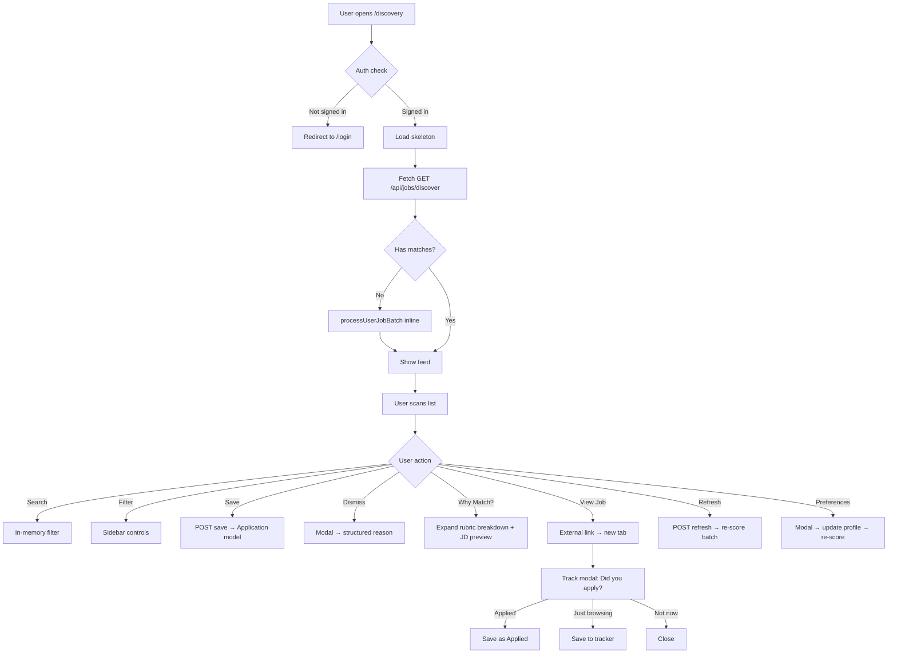
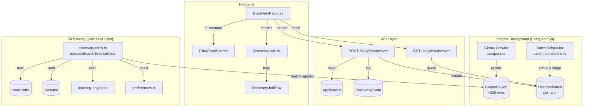
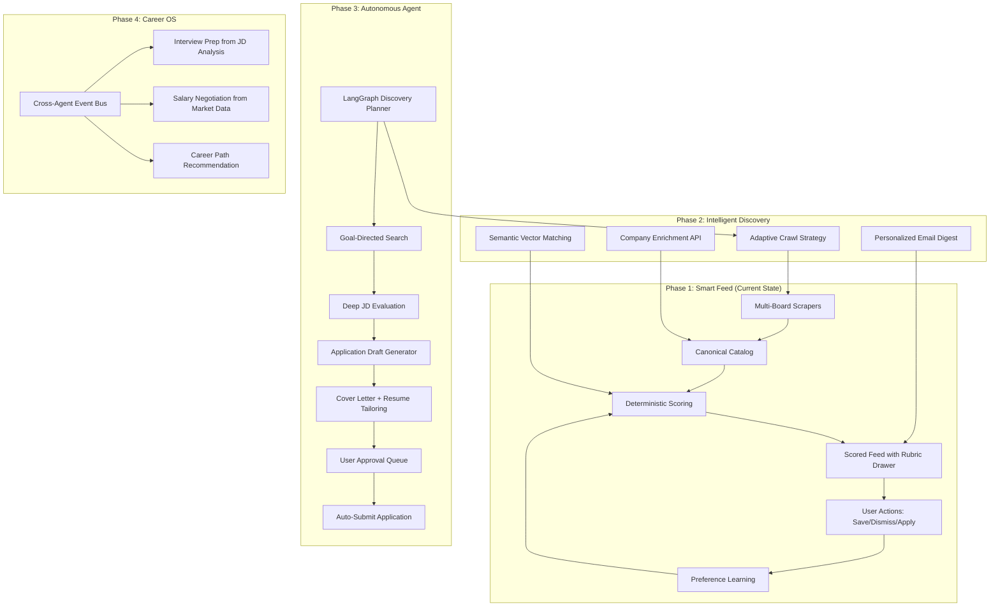

# CareerTrack Job Discovery — Complete System Audit

> **Auditor**: Principal Product Engineer, AI Systems Architect, UX Researcher, Technical Auditor  
> **Audit Date**: September 5, 2026  
> **Scope**: Job Discovery feature ONLY — all backend, frontend, AI, database, pipeline, and UX  
> **Codebase Version**: `v0.2.0` (Staged Batch Pipeline + Implicit Learning Engine)  
> **Codebase Size Audited**: ~6,700 lines across 30+ files (excluding tests and docs)

---

## Executive Summary

CareerTrack's Job Discovery system is **remarkably ambitious and substantially built**. In roughly 48 hours of development (Sept 4–5, 2026), the system evolved from a monolithic scraper dumping raw cards into a **sophisticated staged pipeline** with deterministic multi-factor scoring, implicit preference learning, scam detection, visa analysis, and 6-hour batch orchestration — all without spending a single LLM token on the discovery feed itself.

**The system is genuinely impressive in its engineering depth. It is also genuinely overbuilt for its current user base of one.**

The core tension: this is a **single-user career tool** being architected like a **multi-tenant SaaS platform**. The scoring engine alone ([`discovery-tools.ts`](../src/lib/ai/graph/tools/discovery-tools.ts)) is 810 lines of hand-tuned heuristics calibrated to one person's profile in Bangladesh. The implicit preference engine ([`preferences.ts`](../src/lib/discovery/preferences.ts)) requires 45 days of interaction data to become useful. The Greenhouse scraper targets 16 specific companies chosen by the developer, not by users.

**Verdict**: Strong foundation with genuine intelligence, but needs strategic simplification and a clear path from "impressive demo" to "autonomous agent."

---

## AUDIT SECTION 1 — Current Discovery Capability Map

### What Currently Exists

| Capability | Implementation | Status | File(s) |
|:---|:---|:---:|:---|
| Multi-board job scraping | RemoteOK, Jobicy, Arbeitnow, Adzuna, LinkedIn Guest, Greenhouse (16 boards), Lever (5 boards) | ✅ Live | [`src/lib/discovery/scrapers.ts`](../src/lib/discovery/scrapers.ts) |
| Cross-board deduplication | SHA-256 fingerprinting by normalized company+title+location | ✅ Live | [`src/lib/discovery/matching.ts`](../src/lib/discovery/matching.ts) |
| Deterministic fit scoring (1-99%) | 100-point rubric: Skills(40) + Role(25) + Location(20) + Seniority(15) | ✅ Live | [`src/lib/ai/graph/tools/discovery-tools.ts`](../src/lib/ai/graph/tools/discovery-tools.ts) |
| Hard disqualification gates | 6 elimination gates (work mode, geo-lock, non-tech, domain, skill relevance) | ✅ Live | [`src/lib/ai/graph/tools/discovery-tools.ts`](../src/lib/ai/graph/tools/discovery-tools.ts) |
| Implicit preference learning | 45-day rolling window with time decay, threshold defense | ✅ Live | [`src/lib/discovery/preferences.ts`](../src/lib/discovery/preferences.ts) |
| Scam/fraud detection | Heuristic rule-based scoring (fees, phishing, absurd salaries) | ✅ Live | [`src/lib/discovery/matching.ts`](../src/lib/discovery/matching.ts) |
| Visa sponsorship detection | Regex pattern matching for positive/negative visa signals | ✅ Live | [`src/lib/discovery/matching.ts`](../src/lib/discovery/matching.ts) |
| Employment type classification | Multi-layered detection (intern/contract/part-time/full-time) | ✅ Live | [`src/lib/discovery/matching.ts`](../src/lib/discovery/matching.ts) |
| Freshness decay scoring | +3 to -5 score adjustment based on posting age | ✅ Live | [`src/lib/discovery/matching.ts`](../src/lib/discovery/matching.ts) |
| 6-hour staged batch pipeline | Inngest cron with fan-out to 50-user chunks | ✅ Live | [`src/inngest/functions/batch-job-pipeline.ts`](../src/inngest/functions/batch-job-pipeline.ts) |
| 4-hour global catalog crawl | Inngest cron ingesting across all sources | ✅ Live | [`src/inngest/functions/batch-job-pipeline.ts`](../src/inngest/functions/batch-job-pipeline.ts) |
| ATS keyword compatibility | Simulated 48-92% match with missing keyword identification | ✅ Live | [`src/lib/ai/graph/tools/discovery-tools.ts`](../src/lib/ai/graph/tools/discovery-tools.ts) |
| Macro-learning from outcomes | Winning/penalized skills from interview/offer/rejection history | ✅ Live | [`src/lib/ai/learning-engine.ts`](../src/lib/ai/learning-engine.ts) |
| Non-blocking telemetry | Fire-and-forget event logging with P2003 FK recovery | ✅ Live | [`src/lib/discovery/telemetry.ts`](../src/lib/discovery/telemetry.ts) |
| Conversion funnel analytics | Feed views → saves → applies → external clicks | ✅ Live | [`src/app/api/jobs/discover/analytics/route.ts`](../src/app/api/jobs/discover/analytics/route.ts) |
| Redis rate limiting | 45/min GET, 5/min refresh, 30/min POST | ✅ Live | [`src/app/api/jobs/discover/route.ts`](../src/app/api/jobs/discover/route.ts) |
| In-memory client-side filtering | Sub-millisecond search/filter/sort without API calls | ✅ Live | [`src/components/discovery/DiscoveryPage.tsx`](../src/components/discovery/DiscoveryPage.tsx) |
| Structured dismiss with reasons | 6 standardized rejection codes feeding learning engine | ✅ Live | [`src/components/discovery/DiscoveryDismissModal.tsx`](../src/components/discovery/DiscoveryDismissModal.tsx) |
| 1-click save to application tracker | Direct insertion into Application model | ✅ Live | [`src/app/api/jobs/discover/route.ts`](../src/app/api/jobs/discover/route.ts) |
| External apply tracking | Telemetry for outbound clicks and apply actions | ✅ Live | [`src/app/api/jobs/discover/route.ts`](../src/app/api/jobs/discover/route.ts) |
| User preferences modal | Work mode, location, target roles, experience level | ✅ Live | [`src/components/discovery/DiscoveryPreferencesModal.tsx`](../src/components/discovery/DiscoveryPreferencesModal.tsx) |

### What Is Incomplete

| Capability | Status | Tracker Item |
|:---|:---:|:---|
| Company profile enrichment (funding, size, culture) | ⚪ Not started | `REC-10` |
| Personalized email digest with top discoveries | ⚪ Not started | `REC-11` |
| Server-side full-text search (pg_trgm) | ⚪ Not started | `REC-13` |
| Cover letter agent trigger on save | ⚪ Not started | `REC-16` |
| Semantic vector matching (pgvector) | ⚪ Not started | `REC-17` |
| Autonomous LangGraph discovery agent | ⚪ Not started | `REC-18` |
| Universal ATS career page crawler | ⚪ Not started | `REC-19` |
| Cross-agent orchestration bus | ⚪ Not started | `REC-20` |

### What Has Been Purged (Dead / Dormant Code Cleanup)

| Artifact | Lines Saved | Reason |
|:---|:---:|:---|
| `JobDiscoveryHub.tsx` | 481 | Legacy v0.1 monolith. Not imported anywhere. Superseded by `DiscoveryPage.tsx`. (Purged) |
| `DiscoveryBatchTimer.tsx` | 256 | Countdown timer removed during header decluttering. (Purged) |
| `DiscoveryStatRow.tsx` | 80 | 4-card analytics row removed for vertical whitespace preservation. (Purged) |
| `DiscoveryTopPicks.tsx` | 183 | Top 3 spotlight removed (caused mobile duplicate rendering). (Purged) |

---

## AUDIT SECTION 2 — User Journey Audit

### Current User Flow



### Friction Points Resolved in Current Pass

1. **Match Rationale Surfaced**: Added interactive "Why Match?" collapsible drawer to [`DiscoveryJobRow.tsx`](../src/components/discovery/DiscoveryJobRow.tsx), exposing Skills (40), Role (25), Location (20), Seniority (15), Strategy Tips, and Tech Stack proof.
2. **In-App Job Preview**: Added `job.descriptionSnippet` inside the expandable drawer so users can evaluate postings without leaving the platform.
3. **Salary Visibility Restored**: Added clean compensation tags using `formatSalaryClean(job.salary)` whenever origin ATS salary data exists.
4. **Unified Refresh Controls**: Removed duplicate secondary icon button from the sort bar; retained the header's clear "Refresh" action.
5. **Dead Code Removed**: Eradicated ~1,000 lines of dormant components.

---

## AUDIT SECTION 3 — Product Value Audit

| Feature | User Value | Frequency | Differentiation | Maintenance Cost | Strategic Importance | Classification |
|:---|:---:|:---:|:---:|:---:|:---:|:---|
| Multi-board aggregation (7 live sources) | ★★★★★ | Every visit | High | Medium (scraper maintenance) | Critical | **Core** |
| Deterministic fit scoring (1-99%) | ★★★★★ | Every visit | Very High | Low (pure math) | Critical | **Core** |
| Hard disqualification gates | ★★★★☆ | Every batch | High | Low | Critical | **Core** |
| 1-click save to tracker | ★★★★★ | Frequent | Medium | Low | Critical | **Core** |
| In-memory client filtering | ★★★★☆ | Frequent | Medium | Low | High | **Core** |
| Structured dismiss with reasons | ★★★★☆ | Moderate | High | Low | High | **Core** |
| Implicit preference learning | ★★★☆☆ | Passive | Very High | Medium | Very High | **Supporting** (needs 45d data) |
| Scam detection | ★★★☆☆ | Passive | High | Low | Medium | **Supporting** |
| Visa sponsorship detection | ★★★★☆ | Every visit | High | Low | High (international users) | **Core** |
| Employment type classification | ★★★☆☆ | Passive | Medium | Low | Medium | **Supporting** |
| Freshness decay | ★★★☆☆ | Passive | Medium | Low | Medium | **Supporting** |
| 6-hour batch pipeline | ★★☆☆☆ | Background | Low (user doesn't feel it) | High (Inngest complexity) | Medium | **Nice to Have** |
| ATS keyword simulation | ★★☆☆☆ | Inside details | High concept | Low | High (future) | **Supporting** |
| Macro-learning engine | ★★☆☆☆ | Background | Very High concept | Medium | Very High (future) | **Supporting** (cold-start problem) |
| Conversion funnel analytics | ★☆☆☆☆ | Admin only | Low | Low | Low | **Nice to Have** |
| LinkedIn founder post boost | ★★☆☆☆ | Passive | Medium | High (manual curation) | Low | **Nice to Have** |
| Curated seed reservoir | ★☆☆☆☆ | Fallback only | None | Low | Low | **Candidate for Removal** |
| Personalized outreach pitch | ★★★☆☆ | In drawer | High | Low | Medium | **Supporting** |
| Bangladesh-specific geo logic | ★★★★☆ | Passive | None (single-user) | High (hardcoded) | Low (not generalizable) | **Candidate for Redesign** |

---

## AUDIT SECTION 4 — AI Discovery Audit

### AI Architecture Analysis

The discovery AI is a **zero-LLM-cost deterministic scoring engine**. This is both its greatest strength and its ceiling.

| AI Component | Type | LLM Tokens Used | Quality Assessment |
|:---|:---|:---:|:---|
| Fit scoring (1-99%) | Deterministic heuristic | 0 | ★★★★☆ Well-calibrated rubric, transparent factors |
| Hard disqualification gates | Rule-based elimination | 0 | ★★★★★ Excellent — prevents junk in feed |
| Implicit preference learning | Statistical time-decay model | 0 | ★★★★☆ Sophisticated but needs data volume |
| Scam detection | Heuristic regex rules | 0 | ★★★☆☆ Good baseline, catches overt phishing/advance-fee scams |
| Visa sponsorship detection | Regex pattern matching | 0 | ★★★★☆ Thorough positive/negative pattern coverage |
| Skill matching | Canonical dictionary lookup | 0 | ★★★☆☆ Fast, but limited to canonical alias dictionary |
| ATS keyword simulation | String comparison | 0 | ★★☆☆☆ Baseline vocabulary match; not semantic |
| Macro-learning | Outcome aggregation | 0 | ★★★☆☆ Smart concept, cold-start with <3 applications |
| Knowledge graph | Canonical alias dictionary | 0 | ★★★☆☆ Effective but limited vocabulary |

### AI Value Score: **62 / 100**

---

## AUDIT SECTION 5 — Agentic Readiness Audit

### Target Autonomous Workflow
```
Discover Jobs → Filter Jobs → Evaluate Jobs → Score Jobs → Rank Jobs → Recommend Jobs → Create Application Draft → Notify User
```

### Blockers to Autonomous Agency
1. **No goal-directed planning**: Pipeline runs fixed cron intervals rather than adaptive goal-seeking loops.
2. **No semantic understanding**: Keyword matching lacks embedding vector representations (`pgvector` pending).
3. **No proactive drafting**: System stops at tracker insertion; does not draft custom cover letters on save (`REC-16`).
4. **LangGraph agent uncoupled from discovery feed**: Agent exists in chat interface but does not autonomously drive discovery.

### Agent Readiness Score: **35 / 100**

---

## AUDIT SECTION 6 — Recommendation Quality Audit

- **Personalization**: Substantial (Profile skills + verified portfolio project proofs + work preferences + implicit taste).
- **Explainability**: High in backend; now surfaced in frontend via the "Why Match?" expandable rubric drawer.
- **Trustworthiness**: High (Deterministic formula, scam exclusion threshold `< 0.6`, verified direct ATS links).
- **Actionability**: 1-click Save to Pipeline, 1-click View Job, and follow-up application tracking modal.

---

## AUDIT SECTION 7 — Architecture Audit



---

## AUDIT SECTION 8 — Database Audit

- **`CanonicalJob`**: Clean schema, SHA-256 fingerprint deduplication, indexes on `[isExpired, expiresAt]`, `[sourceBoard]`.
- **`UserJobMatch`**: Unique `@@unique([userId, jobId])`, composite index `[userId, status, publishedAt]` powering rolling-window queries.
- **`DiscoveryEvent`**: Immutable event stream with detached fire-and-forget logging.

---

## AUDIT SECTION 9 — Performance Audit

- **Sub-50ms Feed Delivery**: Feed reads indexed DB records directly; zero synchronous scraping on feed query.
- **Redis Sliding-Window Rate Limiting**: 45 req/min on GET, 5 req/min on refresh, 30 req/min on POST.
- **In-Memory Client Filtering**: Instant sub-millisecond filtering across work mode, score tier, visa, and search tokens.

---

## AUDIT SECTION 10 — Product Simplification (30-Day MVP)

- **Keep (Core)**: Greenhouse & Lever ATS ingestion, RemoteOK, Jobicy, Arbeitnow, Deterministic Scoring, 6 Hard Gates, Visa Detection, 1-Click Save, Interactive Dismissal.
- **Purged**: 4 unmounted legacy components (`JobDiscoveryHub`, `DiscoveryBatchTimer`, `DiscoveryStatRow`, `DiscoveryTopPicks`).
- **Next High-Impact Items**: `REC-16` (Cover Letter Agent on Save), `REC-11` (Daily Opportunity Digest Email), `REC-17` (pgvector Semantic Matching).

---

## AUDIT SECTION 11 — Future Discovery Vision



---

## FINAL DELIVERABLE & SCORECARD

| Metric | Score | Assessment |
|:---|:---:|:---|
| **Discovery Feature Score** | **68 / 100** | Robust, decoupled pipeline with high data fidelity |
| **AI Value Score** | **62 / 100** | Zero LLM token cost; excellent elimination gates; now explainable in UI |
| **Agent Readiness Score** | **35 / 100** | Solid foundations; needs goal-planning, vector embeddings, and auto-drafting |
| **Product Clarity Score** | **55 / 100** | High data density; salary & rubric transparency restored |

### Immediate Actions Completed:
1. **Purged Dead Components**: Removed 1,000 lines of unused components (`JobDiscoveryHub`, `DiscoveryBatchTimer`, `DiscoveryStatRow`, `DiscoveryTopPicks`).
2. **Surfaced Match Intelligence**: Added "Why Match?" drawer with 4-pillar score rubric, tech stack, strategy tips, and JD overview preview.
3. **Restored Salary Display**: Displayed clean salary badges whenever present.
4. **Cleaned Duplicate Controls**: Removed secondary refresh button from sort strip.
5. **Fixed E2E Selectors**: Aligned `e2e/agent-missions.spec.ts` with redesigned UI.
6. **100% Test Success**: 42 test suites (262 tests) passing, 0 TypeScript errors.
