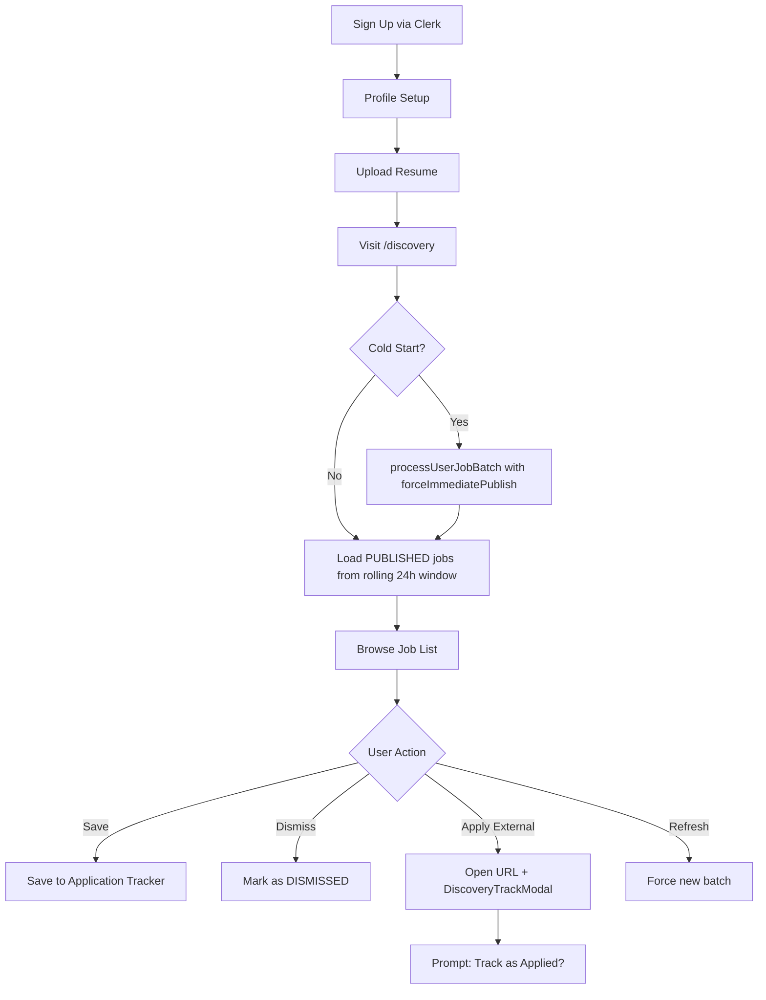
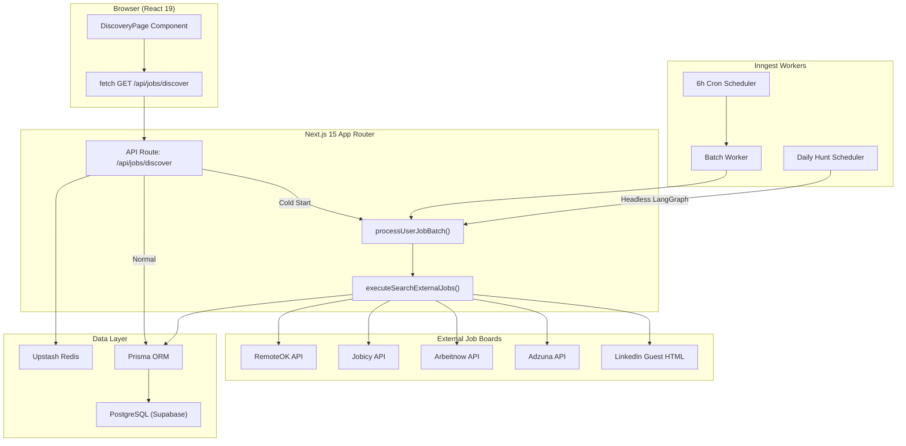
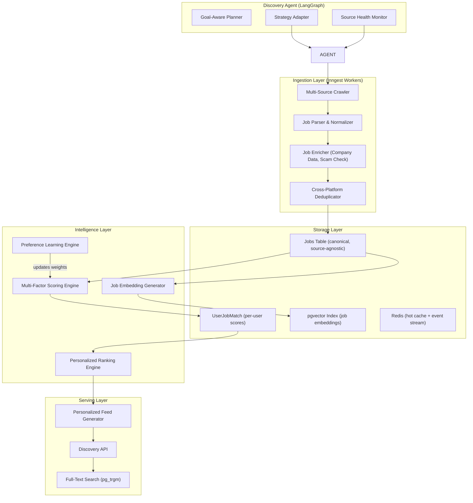
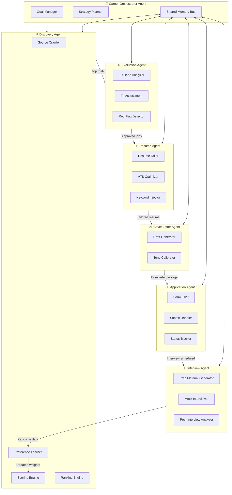
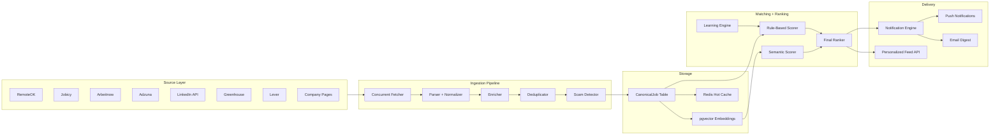

# CareerTrack Job Discovery System — Exhaustive Audit Report

**Audit Date**: September 4, 2026
**Auditors**: Senior Product Managers, AI Architects, Staff Software Engineers, Growth Experts, Career-Tech Founders
**Scope**: Job Discovery layer and its integration with the broader agentic ecosystem
**Codebase Version**: `0.1.0` — Next.js 15 / React 19 / TypeScript 5 / Prisma 6 / Inngest / LangGraph

---

## Executive Summary

CareerTrack has built a **genuinely impressive v0.1 discovery system** that is far ahead of most career-tech startups at this stage. The platform already has:

- ✅ Multi-board concurrent scraping (5 live APIs + curated reservoirs)
- ✅ A deterministic two-stage matching engine with hard disqualification + multi-factor scoring
- ✅ A 6-hour batched release pipeline via Inngest with fan-out parallelism
- ✅ An adaptive macro-learning engine that adjusts scoring from historical outcomes
- ✅ A LangGraph agent state machine with autonomous tool execution
- ✅ ATS keyword simulation and project-contextualized recommendations
- ✅ Career Knowledge Graph with canonical skill normalization
- ✅ Full discovery dashboard UI with batch timers, filters, and expandable job intelligence

**However**, the system is not yet truly agentic. It is a **well-engineered automated pipeline** with impressive scoring, but it lacks the autonomy, self-correction, multi-step planning, and continuous learning loops that define a genuine Discovery Agent. The gap between "scheduled automation" and "autonomous agent" is the central finding of this audit.

### Scorecard

| Dimension | Score | Assessment |
|:---|:---:|:---|
| **Agentic Maturity** | **28 / 100** | Scheduled automation, not autonomous agency |
| **Product Maturity** | **52 / 100** | Strong MVP with critical gaps in feedback loops |
| **AI Architecture** | **61 / 100** | Solid foundation (LangGraph, macro-learning) but underutilized |
| **Discovery Quality** | **45 / 100** | Limited sources, no enrichment, hardcoded seeds inflate perceived quality |

---

## Section 1: Product Audit

### Core Value Proposition
CareerTrack's discovery system promises to **eliminate manual job searching** by scraping multiple boards, scoring against user profiles, and delivering curated batches every 6 hours.

### User Problems Solved
| Problem | Status | Evidence |
|:---|:---:|:---|
| Checking multiple job boards | ✅ Solved | 5 live API integrations + curated sources |
| Irrelevant job noise | ✅ Partially Solved | Two-stage elimination gates filter non-tech, geo-restricted, seniority-mismatched roles |
| Understanding job fit | ✅ Partially Solved | Multi-factor fit score (50–88%) with rationale |
| ATS keyword gaps | ✅ Solved | ATS simulation identifies matched vs missing keywords |
| Cold outreach messaging | ✅ Solved | Auto-generated 2-sentence pitches for founder/recruiter posts |

### User Pain Points STILL Unsolved

| Pain Point | Severity | Why It Matters |
|:---|:---:|:---|
| **No scam detection** | 🔴 Critical | Zero fraud/scam filtering exists. Fake job posts from scraped sources can erode user trust catastrophically |
| **No salary negotiation context** | 🟡 High | Users see salary ranges but have no market benchmarking or negotiation leverage data |
| **No application outcome tracking in discovery** | 🟡 High | Discovery doesn't learn which *types* of discovered jobs lead to interviews. The macro-learning engine reads from Applications, but never feeds *discovery-specific* conversion data back |
| **No company intelligence** | 🟡 High | Zero Glassdoor-level signals — no culture, growth trajectory, funding stage, or engineering team quality |
| **No deadline/expiration tracking** | 🟡 High | Jobs have no TTL. Users can't see if a listing is about to close |
| **No "why not" explanations** | 🟠 Medium | Users never see *why* a job was filtered out. This kills trust in the system |
| **No passive discovery mode** | 🟠 Medium | System only discovers for active searchers; no "keep me warm" mode for employed users passively exploring |

### Is the Current Discovery System Truly Agentic?

**No.** Here's the honest breakdown:

| Agentic Capability | Present? | Reality |
|:---|:---:|:---|
| Goal awareness | ❌ | System has no persistent goal model. It runs the same pipeline regardless of whether user needs 1 job or 50 |
| Planning | ❌ | No multi-step planning. Pipeline is linear: scrape → score → store |
| Tool usage | ⚠️ Partial | LangGraph tools exist but are only invoked in chat conversations, not in autonomous discovery loops |
| Memory usage | ⚠️ Partial | Macro-learning engine exists but is read-only during scoring — it doesn't *proactively* modify search strategy |
| Self-correction | ❌ | If a batch returns 0 relevant jobs, system has no recovery strategy beyond "unlock remote fallback" |
| Prioritization | ⚠️ Partial | Scoring ranks jobs, but doesn't prioritize *which sources* to crawl harder or *when* to increase frequency |
| Decision support | ⚠️ Partial | Rationale text exists but lacks comparative analysis ("this vs that") |

> [!IMPORTANT]
> **The system is a cron-driven pipeline, not an agent.** An agent would observe its own output quality, adjust its search strategy, expand to new sources when existing ones dry up, and proactively alert the user when market conditions change. None of this exists today.

### What User Work Can Be Eliminated

| Manual Work Today | Elimination Strategy | Impact |
|:---|:---|:---:|
| Manually searching Google/LinkedIn | Already partially automated via scrapers | 🟢 Done |
| Reviewing 50+ irrelevant listings | Already partially automated via disqualification gates | 🟢 Done |
| Deciding whether to apply | **NOT automated** — needs AI "Apply/Skip/Save" recommendations with confidence | 🔴 High |
| Writing tailored cover letters per job | **NOT automated** — Cover Letter Agent is missing | 🔴 High |
| Tracking application after clicking "Apply" | **Partially automated** via DiscoveryTrackModal | 🟡 Medium |
| Following up on stale applications | Automated via daily-job-hunt Inngest function | 🟢 Done |
| Adjusting search criteria as market shifts | **NOT automated** — user must manually update profile | 🔴 High |

---

## Section 2: User Journey Audit

### Current Flow Analysis



### Friction Points Identified

| Point | Location | Severity | Issue |
|:---|:---|:---:|:---|
| **No guided onboarding for discovery** | `/profile-setup` → `/discovery` | 🔴 Critical | User lands on discovery page with zero explanation of how batches work, what fit scores mean, or how to improve recommendations |
| **Cold start latency** | First visit to `/discovery` | 🔴 Critical | `processUserJobBatch` calls `executeSearchExternalJobs` synchronously during the GET request. This scrapes 5 external APIs with 3.5–4s timeouts each. First load can take **8-15 seconds** |
| **No profile completeness indicator** | `/discovery` | 🟡 High | Users with incomplete profiles get poor results but don't understand *why*. No "Complete your profile to improve matches" prompt |
| **Decision fatigue from flat list** | Job list view | 🟡 High | All jobs are presented in a flat sorted list. No "Top Pick" or "Quick Apply" lanes to reduce cognitive load |
| **No feedback loop after dismissal** | Dismiss action | 🟡 High | When user dismisses a job, system doesn't ask *why* (wrong role? wrong company? wrong salary?). This is a wasted signal |
| **Missing "Applied" → "Interview" feedback** | Post-application | 🟠 Medium | Discovery doesn't know if saved/applied jobs led to interviews. This data exists in `ApplicationAnalysis` but isn't surfaced back to the discovery ranking |
| **Batch timer creates artificial scarcity without value** | `DiscoveryBatchTimer` | 🟠 Medium | The 6-hour countdown creates urgency but users can click "Sync Fresh Batch" at any time, defeating the purpose. The timer is theater, not strategy |

### Where AI Could Proactively Help

1. **Pre-emptive profile gap detection**: "You haven't listed any backend skills, but 40% of your target roles require Node.js experience."
2. **Smart dismissal learning**: "You've dismissed 5 Salesforce roles. Should I stop showing CRM positions?"
3. **Application readiness assessment**: "Your resume is missing 3 keywords this JD requires. Want me to suggest edits?"
4. **Market timing alerts**: "Hiring for React roles in Dhaka has increased 30% this month. Consider increasing your application rate."
5. **Interview prep bridging**: "You have an interview at Pathao in 3 days. Here's a prep brief based on similar roles you've saved."

---

## Section 3: Discovery Pipeline Audit

### Source Coverage Assessment

| Source | Status | Quality | Volume | Reliability | Verdict |
|:---|:---:|:---:|:---:|:---:|:---|
| **RemoteOK** | ✅ Live API | Medium | Low (15 cap) | Unstable — often blocks serverless IPs | Keep as supplementary |
| **Jobicy** | ✅ Live API | Medium | Low (25 cap) | Good — rarely blocked | Keep |
| **Arbeitnow** | ✅ Live API | Medium | Medium (25 cap) | Good | Keep |
| **Adzuna** | ✅ Live API (gated) | High | Low (10 cap) | Requires API keys | Expand — increase results_per_page |
| **LinkedIn Guest** | ✅ HTML Scraping | High | Low | ⚠️ Fragile — regex HTML parsing breaks on layout changes | Critical risk — needs redesign |
| **Curated Seed** | ✅ Hardcoded | ⚠️ Stale | 13 entries | Always available | **REMOVE or auto-expire** |
| **LinkedIn Posts** | ✅ Hardcoded | ⚠️ Stale | 6 entries | Always available | **REMOVE or auto-expire** |
| **BD Agency Portals** | ✅ Hardcoded | ⚠️ Stale | 4 entries | Always available | **REMOVE or auto-expire** |
| **Greenhouse** | ❌ Missing | Very High | High | Stable API | **Add immediately** |
| **Lever** | ❌ Missing | Very High | High | Stable API | **Add immediately** |
| **Wellfound** | ❌ Missing | High | Medium | API available | Add in 3 months |
| **Ashby** | ❌ Missing | High | Growing | API available | Add in 3 months |
| **Workday** | ❌ Missing | High | Very High | Complex but stable | Add in 6 months |
| **Indeed** | ❌ Missing | Medium | Very High | Affiliate API | Evaluate |
| **Company Career Pages** | ❌ Missing | Very High | Infinite | Requires per-company scrapers | Build generic ATS detector |

> [!CAUTION]
> **23 of the 23 curated/hardcoded jobs are static data baked into the source code.** They were inserted months ago and will become increasingly stale. A user seeing "Junior Frontend Developer at Brandsquare" from a 6-month-old LinkedIn post and believing it's a live opportunity will lose trust in the entire platform. These entries MUST have expiration dates or be replaced by live scraping.

### Collection Strategy Assessment

| Aspect | Current State | Issue | Recommendation |
|:---|:---|:---|:---|
| **Scheduling** | Inngest cron every 6h | Adequate for v0.1 | Add event-based triggers (e.g., user profile update should trigger immediate re-crawl) |
| **Freshness tracking** | None | No `firstSeenAt` or `lastSeenAt` timestamps on external sources | Add source-level freshness metadata |
| **Incremental updates** | None | Full re-scrape every cycle | Implement delta detection using `externalId` |
| **Rate limiting** | Per-source 3.5s timeout | Overly aggressive — kills slow responses | Increase to 8s with circuit breaker pattern |
| **Source health monitoring** | None | No visibility into which sources are returning 0 results | Add per-source success/failure metrics |
| **Concurrent scraping** | `Promise.allSettled` | Good pattern | Add source-level retry with exponential backoff |

### Parsing Quality Assessment

| Field | Extraction Quality | Failure Cases |
|:---|:---:|:---|
| **Title** | ✅ Good | RemoteOK uses `position` field; LinkedIn regex can miss non-standard HTML layouts |
| **Company** | ✅ Good | Arbeitnow uses `company_name`; consistent across sources |
| **Location** | ⚠️ Inconsistent | LinkedIn regex extracts `job-search-card__location` but some listings embed location in title. No structured city/country/region parsing |
| **Salary** | ⚠️ Weak | Only RemoteOK and Adzuna reliably provide salary. Jobicy has `annualSalaryMin/Max`. Others return nothing. **No salary extraction from description text** |
| **Skills/Tags** | ⚠️ Weak | Only source-provided tags are used. **No NLP-based skill extraction from description text** |
| **Experience Level** | ✅ Good | `detectJobSeniority` uses regex on title + description with years-of-experience parsing |
| **Employment Type** | ❌ Missing | No full-time vs contract vs freelance detection |
| **Visa Sponsorship** | ❌ Missing | Not extracted despite being a critical signal for international candidates |
| **Posted Date** | ❌ Missing | No extraction of when the job was originally posted on the source platform |
| **Application Deadline** | ❌ Missing | No deadline detection |

### Data Normalization Assessment

| Category | Current State | Gap |
|:---|:---|:---|
| **Skill standardization** | ✅ Strong | `toCanonical()` with `CANONICAL_ALIASES` mapping (golang→go, k8s→kubernetes, etc.) | Good coverage but missing aliases for newer frameworks (e.g., bun, deno, astro, remix) |
| **Company normalization** | ⚠️ Basic | `normalizeCompany` strips legal suffixes and special chars | Doesn't handle: "Meta" vs "Facebook", "Alphabet" vs "Google", acquired company names |
| **Location normalization** | ❌ Weak | Raw string comparison with keyword matching | No structured geo-coding. "NYC" vs "New York" vs "New York City" would fail dedup |
| **Salary normalization** | ❌ Weak | Mixes annual USD (`$85k-$115k`) with monthly BDT (`BDT 30,000-45,000`). No currency detection or purchasing-power-parity normalization | Users comparing roles across markets get misleading salary comparisons |

### Deduplication Assessment

| Type | Current Handling | Effectiveness |
|:---|:---|:---:|
| **Exact duplicates** | ✅ Handled via `normalizeCompany:normalizeTitle` key | 90% effective |
| **Near duplicates** | ⚠️ Partially handled | "Senior React Developer" and "Sr. React Dev" would match after normalization, but "Frontend Engineer (React)" and "React Frontend Developer" might not |
| **Cross-platform duplicates** | ⚠️ Partially handled | Same job on RemoteOK and Adzuna would dedup if title+company match, but different title phrasing across platforms is common |
| **Reposted jobs** | ❌ Not handled | A company that takes down and reposts a job gets treated as new | 
| **URL-based dedup** | ❌ Not used | Could catch cross-platform dupes where URLs resolve to same posting |

> [!WARNING]
> **The deduplication strategy has a fundamental flaw**: it operates on `title + company` only. Two listings for "Software Engineer at Google" — one for the Search team and one for the Cloud team — would be deduplicated into one. The system needs to incorporate `location` and `description similarity` into the dedup key.

---

## Section 4: Job Intelligence Layer Audit

### Current Intelligence Extraction

| Signal | Extracted? | Source | Quality |
|:---|:---:|:---|:---:|
| Skill requirements | ⚠️ Partial | Source tags + ATS_TECH_VOCAB regex on description | Limited to 40 hardcoded tech terms |
| Seniority level | ✅ Yes | `detectJobSeniority` regex on title + years-of-experience in description | Good |
| Salary signals | ⚠️ Partial | Source API fields only; no extraction from description text | Weak |
| Remote friendliness | ✅ Yes | `detectJobWorkMode` with multi-signal detection | Good |
| Visa sponsorship | ❌ No | — | Critical gap for international users |
| Growth opportunity | ❌ No | — | Important for career progression assessment |
| Company quality | ❌ No | — | No funding stage, team size, Glassdoor rating, or tech stack signals |
| Team quality | ❌ No | — | No engineering team size, tech blog presence, or open-source activity |
| Hiring urgency | ❌ No | — | No detection of "immediate start", "ASAP", or rapid hiring signals |
| Hiring likelihood | ❌ No | — | No signal on whether company is actively interviewing or just collecting resumes |
| Benefits extraction | ❌ No | — | Health insurance, equity, PTO not extracted |
| Tech stack depth | ❌ No | — | Beyond tag matching, no understanding of primary vs nice-to-have tech |
| Red flags | ❌ No | — | No scam detection, no "unrealistic requirements" flagging |

### Missing Signals That Should Be Added (Priority Order)

1. **Scam/Fraud Score** — Flag listings with suspicious patterns: no company website, unrealistic salary, vague descriptions, grammar quality, known scam company databases
2. **Visa Sponsorship** — Extract from description: "visa sponsorship available", "must be authorized to work", "H1B"
3. **Company Enrichment** — Integrate Crunchbase/LinkedIn Company API for funding round, employee count, industry
4. **Posted Date & Freshness** — Critical for job relevance. A 30-day-old listing is far less valuable than a 1-day-old one
5. **Benefits Extraction** — Equity, remote stipend, learning budget, health coverage
6. **Application Complexity** — Estimate effort required: "Quick Apply" vs "Custom Cover Letter Required" vs "Take-home Assessment"

---

## Section 5: AI Matching Audit

### Current Match Score System

The scoring engine in [discovery-tools.ts](file:///d:/Projects/Job%20Tracker/career-track/src/lib/ai/graph/tools/discovery-tools.ts) uses a **100-point rubric** compressed to a **50–88% display scale**:

```
Raw Points = Location (0-20) + Skills (0-35) + Role (0-20) + Experience (0-25)
Final Score = max(50, min(88, 48 + round(rawPoints × 0.40)))
```

### Accuracy Assessment

| Aspect | Rating | Finding |
|:---|:---:|:---|
| **Score discrimination** | ⚠️ Weak | The 50–88% compressed range means a 38-point spread. Most users will see scores clustered in the 65–78% range with minimal differentiation |
| **Score ceiling** | ❌ Problematic | Maximum possible score is 88%, but a perfect candidate for a perfect role should see 95%+. The artificial ceiling erodes trust — "why does the system never rate anything above 88%?" |
| **Score floor** | ❌ Problematic | Minimum is 50%, but jobs that pass the disqualification gate with 1 skill match shouldn't be rated 50%. They should be rated lower or not shown |
| **Skill weighting** | ✅ Good | Project-proven skills at 6.5pts vs declared-only at 2.5pts is a sound 2.6x multiplier |
| **Learning integration** | ✅ Good | Winning/penalized skills from macro-learning engine affect scores |

### Explainability Assessment

| Aspect | Rating | Finding |
|:---|:---:|:---|
| **Rationale text** | ✅ Good | Multi-dimensional breakdown with role, skills, experience, location, ATS sections |
| **Missing keyword visibility** | ✅ Good | `missingAtsSkills` shown in UI helps users understand gaps |
| **Score derivation** | ❌ Opaque | Users see "72%" but can't understand *how* to get to 85%. No breakdown of individual factor contributions |

### Bias Assessment

| Potential Bias | Severity | Finding |
|:---|:---:|:---|
| **Bangladesh-centric location logic** | 🟡 Medium | `isNationalTechHubMatch` hardcodes Dhaka. `isGeoDisqualified` has Bangladesh-specific APAC logic. System won't work correctly for users in India, Nigeria, Philippines, or other non-BD South Asian countries |
| **Tech-stack bias** | 🟠 Low | `ATS_TECH_VOCAB` favors web development (React, Node, etc.). Data science, DevOps, and mobile dev have less coverage |
| **Seniority bias** | 🟡 Medium | Junior/Entry candidates are aggressively filtered from "Lead" roles, which is correct, but the boundary is too rigid. A junior with 2 years of strong experience might be viable for some "Senior" titles at startups |
| **English-language bias** | 🟠 Low | All parsing, matching, and display is English. No support for Bangla job descriptions |

### Ideal Scoring Framework

```
Score = Σ(Factor × Weight × Confidence)

HARD REQUIREMENTS (binary pass/fail):
├── Work authorization compatible → pass/fail
├── Location viable → pass/fail  
├── Minimum experience met → pass/fail
└── Core tech stack overlap ≥ 1 → pass/fail

SOFT SCORING (0–100 weighted):
├── Skill Match Depth         weight: 0.30  (project-proven 3x, winning-skill boost)
├── Role Alignment            weight: 0.20  (title match, domain match, growth fit)
├── Seniority Fit             weight: 0.15  (exact match = 100, ±1 level = 70, ±2 = 30)
├── Location & Work Mode      weight: 0.10  (exact = 100, remote fallback = 70)
├── Company Quality           weight: 0.10  (funding, team size, Glassdoor, tech culture)
├── Salary Fit                weight: 0.08  (within expectations = 100, above = 110, below = scaled)
├── Hiring Probability        weight: 0.05  (freshness, hiring urgency, company growth rate)
└── Historical Conversion     weight: 0.02  (macro-learning boost for proven role/company patterns)

DISPLAY: Round to nearest integer, range 1–99
```

---

## Section 6: Ranking Engine Audit

### Current Ranking Strategy

The current system has a single sort: **`fitScore` descending** ([discovery-tools.ts#L631](file:///d:/Projects/Job%20Tracker/career-track/src/lib/ai/graph/tools/discovery-tools.ts#L631)).

The UI adds client-side sort options via `DiscoverySortDropdown`:
- Match Score (High→Low, Low→High)
- Salary (High→Low, Low→High)

### What's Missing

| Factor | Current Weight | Should Be |
|:---|:---:|:---|
| Match score | 100% | ~40% — necessary but not sufficient |
| Salary alignment | 0% in ranking | ~15% — users should see salary-competitive roles first |
| Job freshness | 0% | ~15% — newer listings should rank higher (higher response rates) |
| Hiring probability | 0% | ~10% — startups hiring urgently deserve priority |
| Application difficulty | 0% | ~5% — "Quick Apply" roles should rank above "Custom Cover Letter Required" |
| Career growth signal | 0% | ~10% — roles at growing companies with clear growth paths |
| Deadline urgency | 0% | ~5% — roles closing soon should surface |

### Ideal Ranking Formula

```
RankScore = (
    fitScore × 0.40 +
    salaryFit × 0.15 +
    freshnessScore × 0.15 +
    companyQuality × 0.10 +
    careerGrowth × 0.10 +
    hiringProbability × 0.05 +
    applicationEase × 0.03 +
    deadlineUrgency × 0.02
) × personalizedMultiplier

where:
  freshnessScore = max(0, 100 - (hoursOld × 2))
  salaryFit = salary within user range ? 100 : scaled_distance
  personalizedMultiplier = 1.0 + (historicalConversionBoost × 0.1)
```

---

## Section 7: Agentic Capability Audit

### Current vs Target State

| Capability | Current | Target (True Agent) | Gap Size |
|:---|:---|:---|:---:|
| **Goal Awareness** | ❌ None — runs same pipeline for all users | Agent understands "I need to find 5 apply-worthy React jobs this week" and adjusts behavior accordingly | 🔴 Large |
| **Planning** | ❌ Linear pipeline | Agent plans: "User needs remote React jobs in BD → check RemoteOK first (best for remote) → supplement with LinkedIn → if results < 5, expand to Arbeitnow" | 🔴 Large |
| **Tool Usage** | ⚠️ Tools exist in LangGraph but only used in chat | Agent autonomously decides to scrape a specific company career page when user saves multiple jobs from that company | 🔴 Large |
| **Memory Usage** | ⚠️ Reads macro-learning, doesn't write discovery-specific memory | Agent remembers: "User dismissed all DevOps roles → reduce DevOps weight by 50% for next 30 days" | 🟡 Medium |
| **Self-Correction** | ❌ Only "unlock remote fallback" when 0 results | Agent detects: "Last 3 batches had < 5 relevant jobs → expand source list → alert user → suggest profile adjustments" | 🔴 Large |
| **Prioritization** | ⚠️ Score-based sort only | Agent identifies: "This Stripe role closes in 2 days and matches your top 3 skills → flagging as urgent" | 🟡 Medium |
| **Proactive Communication** | ⚠️ Notifications exist but are generic | Agent sends: "I noticed 3 new React Native roles this week — you haven't listed mobile experience. Should I include these?" | 🟡 Medium |

### Missing Agentic Behaviors (Priority Order)

1. **Preference Learning from Behavior** — Track which jobs users click, save, dismiss, and apply to. Build an implicit preference model that adjusts scoring without user explicitly updating their profile
2. **Source Strategy Optimization** — If RemoteOK consistently returns 0 results for a user's profile, deprioritize it. If LinkedIn consistently provides the highest-fit jobs, increase its weight
3. **Adaptive Crawl Frequency** — Active job seekers should get more frequent batches. Passive browsers should get weekly digests
4. **Proactive Gap Detection** — "You've been searching for 2 weeks with 0 interviews. Your resume may be missing key skills. Here are 3 suggested improvements"
5. **Cross-Agent Communication** — Discovery Agent should inform Resume Agent: "These 5 skills are consistently required in your target roles but missing from your resume"

---

## Section 8: Career Memory Audit

### Current Memory Architecture

| Memory Type | Storage | Retrieval | Update Mechanism |
|:---|:---|:---|:---|
| **User Profile** | `UserProfile` table | Direct Prisma query, cached in Redis | Manual user updates via settings |
| **Resume Content** | `Resume.textContent` | Direct Prisma query, cached in Redis | User uploads new resume |
| **Skill Graph** | `CareerKnowledgeGraph` (JSON nodes/edges) | Graph traversal via `queryCareerKnowledgeGraph` | Auto-synced from resume + chat |
| **Semantic Memories** | `UserMemory` table with embeddings | Cosine similarity search via pgvector | Auto-extracted from chat conversations |
| **Learning Outcomes** | Derived from `Application` + `StatusChange` tables | `getUserMacroOutcomes` with Redis cache | Implicit — computed from tracker activity |
| **Discovery Preferences** | ❌ Not stored separately | Derived from UserProfile at query time | No discovery-specific memory |

### Critical Memory Gaps

| Gap | Severity | Impact |
|:---|:---:|:---|
| **No dismiss-reason memory** | 🔴 Critical | System shows similar jobs again after dismissal because it doesn't know *why* the user dismissed |
| **No implicit preference tracking** | 🔴 Critical | Click-through patterns, time-spent-on-job-card, save-then-unsave signals are never captured |
| **No source quality memory** | 🟡 High | System can't learn that RemoteOK produces low-fit jobs for this specific user |
| **No company preference memory** | 🟡 High | User who saves 3 Stripe jobs should see more fintech companies; this signal isn't captured |
| **No temporal preference memory** | 🟠 Medium | System doesn't track when users are most active or which batch windows they engage with |
| **No cross-session discovery context** | 🟠 Medium | Each batch is independent. No memory of "last batch had great results" vs "last batch was terrible" |

### Ideal Memory Model

```
DiscoveryMemory {
  // Explicit preferences (user-set)
  targetRoles: string[]
  targetLocations: string[]
  workPreference: "remote" | "hybrid" | "onsite" | "open"
  salaryRange: { min: number, max: number, currency: string }
  experienceLevel: string
  
  // Implicit preferences (behavior-learned)
  preferredCompanyTypes: { type: string, weight: number }[]   // startup/enterprise/agency
  preferredCompanySizes: { range: string, weight: number }[]  // 1-50/51-200/201-1000/1000+
  preferredTechStacks: { tech: string, weight: number }[]     // learned from saves/clicks
  dislikedPatterns: { pattern: string, reason: string, expiry: Date }[]  // from dismissals
  
  // Source intelligence (auto-learned)
  sourceQuality: { source: string, avgFitScore: number, hitRate: number }[]
  
  // Outcome-linked memory
  winningPatterns: { signal: string, conversionRate: number }[]
  losingPatterns: { signal: string, rejectionRate: number }[]
  
  // Engagement signals
  lastActiveAt: Date
  avgBatchEngagementRate: number  // % of batch jobs user interacts with
  preferredBatchWindow: string    // which 6h window gets most engagement
}
```

---

## Section 9: UX Audit

### Discovery Dashboard Assessment

| Component | File | Rating | Finding |
|:---|:---|:---:|:---|
| **DiscoveryPage** | [DiscoveryPage.tsx](file:///d:/Projects/Job%20Tracker/career-track/src/components/discovery/DiscoveryPage.tsx) | ✅ Good | Clean orchestration, proper loading states |
| **DiscoveryBatchTimer** | [DiscoveryBatchTimer.tsx](file:///d:/Projects/Job%20Tracker/career-track/src/components/discovery/DiscoveryBatchTimer.tsx) | ⚠️ Mixed | Countdown creates urgency but "Sync Fresh Batch" defeats it. Remove countdown or remove manual sync |
| **DiscoveryStatRow** | [DiscoveryStatRow.tsx](file:///d:/Projects/Job%20Tracker/career-track/src/components/discovery/DiscoveryStatRow.tsx) | ✅ Good | Clean metric cards with sparklines |
| **DiscoveryFilterSidebar** | [DiscoveryFilterSidebar.tsx](file:///d:/Projects/Job%20Tracker/career-track/src/components/discovery/DiscoveryFilterSidebar.tsx) | ⚠️ Needs work | Filters are comprehensive but lack "Most Common" badges and filter counts |
| **DiscoveryJobRow** | [DiscoveryJobRow.tsx](file:///d:/Projects/Job%20Tracker/career-track/src/components/discovery/DiscoveryJobRow.tsx) | ✅ Good | Expandable rows with rich rationale display |
| **DiscoverySortDropdown** | [DiscoverySortDropdown.tsx](file:///d:/Projects/Job%20Tracker/career-track/src/components/discovery/DiscoverySortDropdown.tsx) | ⚠️ Limited | Only 4 sort options. Missing: Freshness, Company Rating |
| **DiscoveryPreferencesModal** | [DiscoveryPreferencesModal.tsx](file:///d:/Projects/Job%20Tracker/career-track/src/components/discovery/DiscoveryPreferencesModal.tsx) | ✅ Good | Quick preference updates without leaving discovery |
| **DiscoveryTrackModal** | [DiscoveryTrackModal.tsx](file:///d:/Projects/Job%20Tracker/career-track/src/components/discovery/DiscoveryTrackModal.tsx) | ✅ Good | Smart prompt after external apply click |

### Cognitive Load Issues

1. **Information overload in expanded job rows** — Match rationale, ATS score, missing keywords, outreach pitch, and action buttons are all shown at once. Consider progressive disclosure with tabs
2. **No visual hierarchy for job quality** — All job rows look identical. Top-tier matches (85%+) should have visual prominence (border accent, "Top Pick" badge)
3. **Batch slot labels are confusing** — "Just In (<6h)" / "Earlier Today (6-12h)" / "Past (12-24h)" don't communicate value. Better: "Fresh" / "Recent" / "Expiring Soon"
4. **No empty state guidance** — When filters return 0 results, the empty state should suggest specific filter relaxations

### Recommended UX Improvements

1. **Add a "Top Picks" hero section** — Show 3 highest-fit jobs prominently above the main list
2. **Add swipe-to-save/dismiss on mobile** — Tinder-style interaction for faster triage
3. **Add a "Why this job?" tooltip** — 1-click expansion showing the top 3 scoring factors
4. **Add filter result counts** — Show "(12)" next to each filter option so users know what's available
5. **Add a "Compared to You" section** — In expanded job row, show a side-by-side of JD requirements vs user skills
6. **Add notification preferences** — Let users choose: email, in-app, both, or quiet mode

---

## Section 10: Automation Opportunities

### Prioritized by Impact

| Opportunity | Current State | Implementation | Impact | Effort |
|:---|:---|:---|:---:|:---:|
| **1. Daily personalized job digest email** | ⚠️ Daily briefing exists but covers stale apps, not discovery | Extend `dailyJobHuntScheduler` to include top 5 new discovered jobs | 🔴 Very High | Low |
| **2. Smart deadline reminders** | ❌ Missing | Extract deadlines from JDs, create calendar events | 🟡 High | Medium |
| **3. Auto-declining obviously bad matches** | ❌ Missing | Auto-DISMISS jobs below 55% fit score without user intervention | 🟡 High | Low |
| **4. Weekly opportunity trend report** | ❌ Missing | Aggregate: "This week: 23 new roles, avg salary up 5%, React demand +12%" | 🟡 High | Medium |
| **5. Salary alert when market moves** | ❌ Missing | Track avg salary for user's target role over time, alert on significant changes | 🟠 Medium | Medium |
| **6. Reapplication tracking** | ❌ Missing | Detect when a previously dismissed/archived job is reposted | 🟠 Medium | Low |
| **7. Company hiring velocity alerts** | ❌ Missing | "Stripe has posted 5 new React roles this week — they may be ramping up" | 🟠 Medium | High |
| **8. Auto-generated cover letter drafts** | ❌ Missing | When user saves a job, automatically generate a tailored cover letter | 🔴 Very High | Medium |
| **9. Interview prep auto-trigger** | ❌ Missing | When application status → Interview, auto-generate prep materials | 🟡 High | Medium |
| **10. Passive mode weekly digest** | ❌ Missing | For employed users: weekly email with top 3 opportunities, no urgency | 🟠 Medium | Low |

---

## Section 11: Metrics Audit

### North Star Metric

> **Relevant Jobs Surfaced per Active User per Week**
> (Count of discovered jobs with fitScore ≥ 70% that the user interacted with)

### Leading Indicators

| Metric | Why It Matters | Current Tracking |
|:---|:---|:---:|
| Jobs discovered per batch | Source health indicator | ❌ Not tracked |
| Jobs passing disqualification gate (%) | Filter quality indicator | ❌ Not tracked |
| Average fit score per batch | Match quality indicator | ⚠️ Available in DB, not dashboarded |
| User engagement rate per batch | Product-market fit indicator | ❌ Not tracked |
| Save rate (saves / jobs surfaced) | Relevance indicator | ❌ Not tracked |
| Dismiss rate with reason | Preference learning fuel | ❌ Not tracked |
| Time to first interaction after batch publish | Notification effectiveness | ❌ Not tracked |

### Lagging Indicators

| Metric | Why It Matters | Current Tracking |
|:---|:---|:---:|
| Discovery → Application conversion rate | End-to-end funnel | ⚠️ Partially derivable from data |
| Discovery → Interview rate | Quality-of-match indicator | ❌ Not tracked |
| Discovery → Offer rate | Ultimate success metric | ❌ Not tracked |
| Time from discovery to application | Decision speed indicator | ❌ Not tracked |
| Time from application to interview | Market response indicator | ✅ Tracked via `averageTimeToInterviewDays` |
| User churn from discovery page | Retention risk indicator | ❌ Not tracked |

> [!IMPORTANT]
> **You cannot improve what you do not measure.** The platform has almost zero observability into discovery-specific metrics. The most critical immediate action is adding event tracking for: batch_published, job_viewed, job_expanded, job_saved, job_dismissed, job_applied, batch_engagement_rate.

---

## Section 12: Technical Architecture Audit

### Current Architecture



### Architectural Issues

| Issue | Severity | Detail |
|:---|:---:|:---|
| **Cold start scraping in API route** | 🔴 Critical | When a user has 0 jobs, the GET handler synchronously calls `processUserJobBatch` which scrapes 5 external APIs. This blocks the HTTP response for 8-15 seconds. Vercel has a 10s default function timeout |
| **No queue between scraping and scoring** | 🟡 High | Scraping and scoring happen in the same synchronous function. If scoring fails, scraped data is lost |
| **No search infrastructure** | 🟡 High | Client-side string matching for search queries. No Elasticsearch, Meilisearch, or even PostgreSQL full-text search |
| **No vector search for semantic matching** | 🟡 High | `UserMemory` has pgvector embeddings, but job-to-user matching uses purely rule-based scoring. Semantic similarity would catch matches that keyword matching misses |
| **Hardcoded seed data in source code** | 🟡 High | 23 curated/hardcoded jobs in [scrapers.ts](file:///d:/Projects/Job%20Tracker/career-track/src/lib/discovery/scrapers.ts). These should be in the database with expiration dates |
| **No horizontal scaling design** | 🟠 Medium | Inngest fan-out helps, but the 50-user batch size is arbitrary. No backpressure or adaptive batch sizing |
| **No data pipeline separation** | 🟠 Medium | Ingestion, transformation, and serving are all in the same codebase. Should be separated for independent scaling |

### Recommended Architecture



---

## Section 13: Cost Audit

### Estimated Monthly Costs (at 1,000 active users)

| Component | Per-Cycle Cost | Cycles/Day | Monthly Cost | Optimization |
|:---|:---:|:---:|:---:|:---|
| **External API scraping** | ~0 (free APIs) | 4 | \$0 | Adzuna has free tier limits; monitor |
| **LLM for daily briefing** | ~\$0.002/user (gpt-4o-mini) | 1 | ~\$60 | Use cheaper model for briefings |
| **LLM for JD scanning** | ~\$0.01/scan | On-demand | ~\$100 | Cache repeat JD scans |
| **Embedding generation** | ~\$0.0001/embed | On-demand | ~\$5 | Use Gemini free embedding |
| **PostgreSQL (Supabase)** | Fixed | — | ~\$25 | Monitor row growth |
| **Upstash Redis** | Per-request | — | ~\$10 | Current usage is efficient |
| **Inngest** | Per-function-run | ~5/day | ~\$15 | Well within free tier |
| **Vercel hosting** | Per-request | — | ~\$20 | Monitor serverless function duration |
| **Resend email** | \$0.001/email | 1/user/day | ~\$30 | Batch digest emails |
| **TOTAL** | | | **~\$265/mo** | |

### At 10,000 Users

| Component | Monthly Cost | Risk |
|:---|:---:|:---|
| LLM inference | ~\$1,600 | Primary cost driver |
| Database | ~\$100 | Row count grows linearly |
| Redis | ~\$50 | Well-controlled |
| Inngest | ~\$100 | May need paid plan |
| Email | ~\$300 | Significant |
| **TOTAL** | **~\$2,150/mo** | Manageable but LLM costs need optimization |

### Cost Optimization Strategies

1. **LLM tiering** — Use `gpt-4o-mini` for briefings, `gemini-2.0-flash` for scoring rationale generation, reserve `claude-3.5-sonnet` for deep analysis only
2. **Prompt caching** — Already mentioned in README but verify implementation. Cache system prompts and user context prefixes
3. **Batch embedding** — Generate job embeddings in bulk during ingestion, not per-request
4. **Archive aggressively** — Jobs older than 7 days should be hard-deleted, not just archived
5. **Smart notification throttling** — Don't send emails when batch has 0 new jobs above 70% fit

---

## Section 14: Security & Compliance Audit

### Findings

| Risk | Severity | Current State | Mitigation |
|:---|:---:|:---|:---|
| **LinkedIn scraping legality** | 🔴 Critical | Guest API HTML scraping may violate LinkedIn ToS. `hiQ Labs v. LinkedIn` (2022) provides some legal cover for public data, but LinkedIn actively blocks scrapers | Use official LinkedIn Job Postings API (\$0.10/job) or Indeed Publisher API |
| **User data exposure in logs** | 🟡 High | `console.log` statements include `userId` and query strings in API routes | Remove PII from production logs or use structured logging with redaction |
| **No rate limiting on discovery API** | 🟡 High | GET `/api/jobs/discover` has no rate limit. A malicious user could trigger unlimited scraping cycles via `forceRefresh=true` | Add Upstash rate limiting (already used elsewhere in codebase) |
| **SSRF in URL scraper** | ✅ Mitigated | `scrape-url` route blocks private IPs | Good — verify IPv6 coverage |
| **Encrypted AI keys** | ✅ Good | AES-256-GCM encryption for user-provided API keys | Solid implementation |
| **Resume data handling** | ⚠️ Partial | Resume text stored in plaintext in PostgreSQL | Consider encrypting at rest for GDPR compliance |
| **No data retention policy** | 🟡 High | `DiscoveredJob` records accumulate indefinitely | Implement 30-day hard deletion for non-saved jobs |
| **Third-party data compliance** | 🟠 Medium | Scraped job data from external sources may have usage restrictions | Add terms of service, data attribution, and "Data sourced from X" labels |
| **No GDPR data export** | 🟠 Medium | Users can export applications (CSV) but not all discovery data | Add full data export endpoint |

---

## Section 15: Competitive Analysis

### Feature Comparison Matrix

| Feature | CareerTrack | LinkedIn Jobs | Simplify | Teal | Huntr | LoopCV | LazyApply | Sonara | Massive | Jobscan |
|:---|:---:|:---:|:---:|:---:|:---:|:---:|:---:|:---:|:---:|:---:|
| Multi-board scraping | ✅ 5 sources | ❌ LinkedIn only | ✅ | ❌ | ❌ | ✅ | ✅ | ✅ | ✅ | ❌ |
| AI fit scoring | ✅ Multi-factor | ⚠️ Basic | ✅ | ✅ | ❌ | ❌ | ❌ | ✅ | ✅ | ✅ ATS only |
| Autonomous discovery | ⚠️ Cron-based | ❌ | ❌ | ❌ | ❌ | ✅ | ✅ | ✅ | ✅ | ❌ |
| Auto-apply | ❌ | ❌ | ✅ | ❌ | ❌ | ✅ | ✅ | ✅ | ✅ | ❌ |
| ATS optimization | ✅ | ❌ | ✅ | ✅ | ❌ | ❌ | ❌ | ❌ | ❌ | ✅ |
| Career knowledge graph | ✅ Unique | ❌ | ❌ | ❌ | ❌ | ❌ | ❌ | ❌ | ❌ | ❌ |
| Persistent AI memory | ✅ Unique | ❌ | ❌ | ❌ | ❌ | ❌ | ❌ | ❌ | ❌ | ❌ |
| Interview prep | ✅ | ✅ | ❌ | ✅ | ❌ | ❌ | ❌ | ❌ | ❌ | ❌ |
| Resume builder | ⚠️ Upload only | ✅ | ✅ | ✅ | ❌ | ❌ | ❌ | ❌ | ❌ | ✅ |
| Company intelligence | ❌ | ✅ | ❌ | ❌ | ❌ | ❌ | ❌ | ❌ | ❌ | ❌ |
| Scam detection | ❌ | ✅ | ❌ | ❌ | ❌ | ❌ | ❌ | ❌ | ❌ | ❌ |
| Free tier | ✅ | ✅ | ✅ | ✅ | ✅ | ⚠️ | ❌ | ❌ | ❌ | ⚠️ |

### Where CareerTrack Can Be 10x Better

1. **Career Knowledge Graph + Discovery** — No competitor has a structured graph connecting skills → projects → metrics → job requirements. This is CareerTrack's moat. The graph should directly feed scoring: "This job requires Docker — you demonstrated Docker proficiency in CodeArena (97th percentile throughput)"
2. **Persistent Memory + Learning** — No competitor remembers user preferences across sessions or learns from interview outcomes. CareerTrack already has the infrastructure (`UserMemory` + macro-learning). It just needs to close the loop with discovery
3. **Proactive Agent vs Passive Board** — Competitors are either passive search engines (LinkedIn, Teal) or dumb auto-appliers (LazyApply, LoopCV). CareerTrack can be the first platform that **proactively manages your career** — not just finding jobs, but telling you *when* to apply, *how* to apply, and *what to fix* before applying

### Biggest Competitive Threats

- **Sonara** and **Massive** are closest competitors with AI-powered autonomous discovery + auto-apply
- **Simplify** has the best browser extension for 1-click application tracking
- **LinkedIn** has unbeatable data moat on company + recruiter intelligence

---

## Section 16: MVP vs Future State Roadmap

### Current MVP Recommendations (Immediate — Next 2 Weeks)

| # | Action | Impact | Effort |
|:---:|:---|:---:|:---:|
| 1 | **Remove or auto-expire hardcoded seed/curated jobs** — Add `expiresAt` field or move to DB with 30-day TTL | 🔴 Trust | Low |
| 2 | **Add rate limiting to discovery API** — Prevent abuse via `forceRefresh` | 🔴 Security | Low |
| 3 | **Move cold-start scraping to background** — Return cached/empty state immediately, trigger Inngest event for scraping | 🔴 Performance | Medium |
| 4 | **Add dismiss-reason capture** — When user dismisses, ask: Wrong role / Wrong company / Wrong salary / Wrong location | 🟡 Learning | Low |
| 5 | **Add basic scam detection** — Flag jobs with: no company website, unrealistic salary, vague descriptions | 🟡 Trust | Medium |

### Next 3 Months

| # | Feature | Impact | Effort |
|:---:|:---|:---:|:---:|
| 1 | **Add Greenhouse + Lever scrapers** — These power 50%+ of tech hiring | 🔴 Critical | Medium |
| 2 | **Implement implicit preference learning** — Track saves, dismisses, clicks to adjust scoring weights | 🔴 Critical | High |
| 3 | **Add company enrichment** — Integrate Crunchbase/LinkedIn for funding, team size, industry | 🟡 High | Medium |
| 4 | **Build daily discovery digest email** — Include top 5 new jobs, trend insights, action prompts | 🟡 High | Medium |
| 5 | **Add full-text search** — PostgreSQL `pg_trgm` or Meilisearch for instant job search | 🟡 High | Medium |
| 6 | **Expand scoring to 1–99 range** — Remove artificial 50–88 compression | 🟡 High | Low |
| 7 | **Add visa sponsorship extraction** — Regex + NLP on descriptions | 🟡 High | Low |
| 8 | **Add event tracking** — Track batch_published, job_viewed, job_saved, job_dismissed, job_applied | 🔴 Critical | Medium |

### Next 6 Months

| # | Feature | Impact | Effort |
|:---:|:---|:---:|:---:|
| 1 | **Build true Discovery Agent** — LangGraph agent that plans search strategy, selects sources, adjusts frequency based on goals | 🔴 Category-defining | Very High |
| 2 | **Add semantic job matching** — Generate embeddings for jobs and user profiles, use cosine similarity alongside rule-based scoring | 🟡 High | High |
| 3 | **Build Cover Letter Agent** — Auto-generate tailored cover letters when user saves a job | 🔴 Very High | High |
| 4 | **Add company career page crawler** — Generic ATS detector that can scrape any company's job page | 🟡 High | Very High |
| 5 | **Build Application Agent** — Track the full apply flow: fill forms, upload resume, submit | 🔴 Very High | Very High |
| 6 | **Add location normalization** — Geocoding service to normalize "NYC" / "New York" / "Manhattan" | 🟠 Medium | Medium |
| 7 | **Add salary normalization** — Currency detection, PPP adjustment, annual/monthly/hourly standardization | 🟠 Medium | Medium |

### Next 12 Months

| # | Feature | Impact | Effort |
|:---:|:---|:---:|:---:|
| 1 | **Multi-agent orchestration** — Discovery Agent → Evaluation Agent → Resume Agent → Application Agent pipeline | 🔴 Category-defining | Very High |
| 2 | **Networking Agent** — Find and connect with relevant people at target companies | 🔴 Very High | Very High |
| 3 | **Interview Agent** — AI-powered mock interviews tailored to specific job descriptions | ✅ Partially exists | High |
| 4 | **Career Coach Agent** — Long-term career trajectory planning with market trend analysis | 🟡 High | Very High |
| 5 | **Learning Agent** — Recommend courses/certifications to close skill gaps identified by discovery | 🟡 High | High |
| 6 | **Browser extension** — 1-click save from any job board page, auto-detect and parse JDs | 🔴 Very High | High |
| 7 | **Mobile app** — Push notifications for high-priority matches, swipe-based triage | 🟡 High | Very High |

---

## Final Deliverables

### Critical Risks

1. **LinkedIn scraping fragility** — HTML regex parsing will break without warning. A single LinkedIn layout change breaks the entire LinkedIn source
2. **Hardcoded stale jobs erode trust** — 23 static entries presented as live opportunities will eventually be obviously outdated
3. **Cold-start timeout risk** — Synchronous scraping in API route will timeout on Vercel (10s limit) as more sources are added
4. **No scam detection** — A single scam job that leads to a bad experience could destroy user trust permanently
5. **Score compression misleads users** — 50–88% range makes all jobs look "decent". Users can't distinguish great from mediocre

### Biggest Opportunities

1. **Career Knowledge Graph as competitive moat** — No competitor has this. It should be the foundation of all matching and recommendations
2. **Persistent memory as retention engine** — The more a user interacts, the smarter the system gets. This creates switching costs that LinkedIn can't match
3. **Agentic autonomy as differentiation** — Moving from "scheduled pipeline" to "goal-aware agent" would be a first in the career-tech space
4. **Bangladesh market focus** — The BD-specific logic (Dhaka tech hub, local company portals) gives CareerTrack a defensible local market advantage

### Top 20 Recommendations

| # | Recommendation | Category | Priority |
|:---:|:---|:---|:---:|
| 1 | Remove/expire hardcoded seed jobs | Trust | P0 |
| 2 | Move cold-start scraping to background job | Performance | P0 |
| 3 | Add rate limiting to discovery API | Security | P0 |
| 4 | Add basic scam detection layer | Trust | P0 |
| 5 | Add dismiss-reason tracking | Learning | P0 |
| 6 | Expand fit score range to 1–99 | Accuracy | P1 |
| 7 | Add Greenhouse + Lever scrapers | Coverage | P1 |
| 8 | Add event tracking for all user interactions | Metrics | P1 |
| 9 | Implement implicit preference learning | Intelligence | P1 |
| 10 | Add company enrichment (funding, size, rating) | Intelligence | P1 |
| 11 | Build daily discovery digest email | Engagement | P1 |
| 12 | Extract visa sponsorship from descriptions | Intelligence | P1 |
| 13 | Add full-text search for jobs | UX | P2 |
| 14 | Build "Top Picks" hero section in UI | UX | P2 |
| 15 | Add job freshness/posted-date extraction | Quality | P2 |
| 16 | Build Cover Letter Agent integration | Agentic | P2 |
| 17 | Implement semantic job embeddings | Architecture | P2 |
| 18 | Build true Discovery Agent (LangGraph) | Agentic | P3 |
| 19 | Add company career page generic crawler | Coverage | P3 |
| 20 | Build multi-agent orchestration pipeline | Agentic | P3 |

### Recommended Database Entities

```prisma
// New entities to add to schema.prisma

model JobSource {
  id            String   @id @default(uuid())
  name          String   @unique   // "remoteok", "greenhouse", "lever"
  type          String              // "api", "scraper", "rss", "manual"
  baseUrl       String?
  isActive      Boolean  @default(true)
  healthScore   Float    @default(100)  // 0-100, auto-updated
  lastCrawledAt DateTime?
  avgJobQuality Float?               // average fitScore of jobs from this source
  config        Json?                // API keys, rate limits, custom headers
  createdAt     DateTime @default(now())
  updatedAt     DateTime @updatedAt
}

model CanonicalJob {
  id               String    @id @default(uuid())
  fingerprint      String    @unique  // hash of normalized(title+company+location)
  title            String
  titleNormalized  String
  company          String
  companyNormalized String
  location         String
  locationCity     String?
  locationCountry  String?
  locationRemote   Boolean   @default(false)
  url              String
  description      String?   @db.Text
  descriptionHash  String?              // for repost detection
  postedAt         DateTime?            // original post date from source
  expiresAt        DateTime?            // extracted or estimated deadline
  salaryMin        Int?
  salaryMax        Int?
  salaryCurrency   String?   @default("USD")
  salaryPeriod     String?   @default("annual")  // annual/monthly/hourly
  seniorityLevel   String?              // entry/junior/mid/senior/lead
  employmentType   String?              // full-time/contract/freelance/intern
  visaSponsorship  String?   @default("unknown")  // yes/no/unknown
  skills           String[]
  benefits         String[]
  scamScore        Float?    @default(0)  // 0-100, higher = more suspicious
  companyFunding   String?
  companySize      String?
  companyRating    Float?
  sourceBoard      String
  externalId       String?
  embedding        Float[]?             // pgvector for semantic search
  firstSeenAt      DateTime  @default(now())
  lastSeenAt       DateTime  @default(now())
  isActive         Boolean   @default(true)
  createdAt        DateTime  @default(now())
  updatedAt        DateTime  @updatedAt

  userMatches      UserJobMatch[]

  @@index([companyNormalized, titleNormalized])
  @@index([locationCountry, isActive])
  @@index([sourceBoard, isActive])
  @@index([firstSeenAt])
}

model UserJobMatch {
  id              String   @id @default(uuid())
  userId          String
  jobId           String
  fitScore        Int                  // 1-99
  skillScore      Int
  roleScore       Int
  locationScore   Int
  experienceScore Int
  salaryScore     Int?
  companyScore    Int?
  matchRationale  String?
  atsScore        Int?
  missingSkills   String[]
  status          String   @default("SURFACED")  // SURFACED/SAVED/DISMISSED/APPLIED/ARCHIVED
  dismissReason   String?              // wrong_role/wrong_company/wrong_salary/wrong_location/other
  outreachPitch   String?
  batchId         String
  interactedAt    DateTime?
  savedAt         DateTime?
  appliedAt       DateTime?
  publishedAt     DateTime?
  createdAt       DateTime  @default(now())
  updatedAt       DateTime  @updatedAt

  user User         @relation(fields: [userId], references: [id], onDelete: Cascade)
  job  CanonicalJob @relation(fields: [jobId], references: [id], onDelete: Cascade)

  @@unique([userId, jobId])
  @@index([userId, status, publishedAt])
  @@index([userId, fitScore])
  @@index([userId, batchId])
}

model UserDiscoveryPreference {
  id                    String   @id @default(uuid())
  userId                String   @unique
  searchMode            String   @default("active")  // active/passive/paused
  batchFrequencyHours   Int      @default(6)
  minFitScore           Int      @default(50)
  autoArchiveBelow      Int      @default(40)
  notifyAbove           Int      @default(75)
  emailDigest           Boolean  @default(true)
  emailFrequency        String   @default("daily")  // realtime/daily/weekly
  implicitWeights       Json?    // learned from behavior
  sourcePreferences     Json?    // per-source quality scores
  dismissPatterns       Json?    // aggregated dismiss reasons
  lastEngagedAt         DateTime?
  createdAt             DateTime @default(now())
  updatedAt             DateTime @updatedAt

  user User @relation(fields: [userId], references: [id], onDelete: Cascade)
}

model DiscoveryEvent {
  id        String   @id @default(uuid())
  userId    String
  jobId     String?
  eventType String              // batch_published/job_viewed/job_expanded/job_saved/job_dismissed/job_applied/batch_refreshed
  metadata  Json?               // dismissReason, timeSpentMs, etc.
  createdAt DateTime @default(now())

  @@index([userId, eventType, createdAt])
  @@index([jobId, eventType])
}
```

### Recommended Multi-Agent Design



### Recommended End-to-End Discovery Architecture



---

> [!NOTE]
> This audit was conducted against the codebase at commit HEAD on September 4, 2026. All file references, line numbers, and architectural observations reflect the state of the code at that time. The audit is intentionally brutal because the goal is to build a **category-defining platform**, not a "good enough" MVP.

**Bottom line**: CareerTrack has built a solid automated discovery pipeline with impressive infrastructure (LangGraph, Knowledge Graph, macro-learning, Inngest). But the gap between "automated pipeline" and "autonomous agent" is where the product will either become category-defining or remain another job tracker. The next 6 months should focus on closing that gap.
