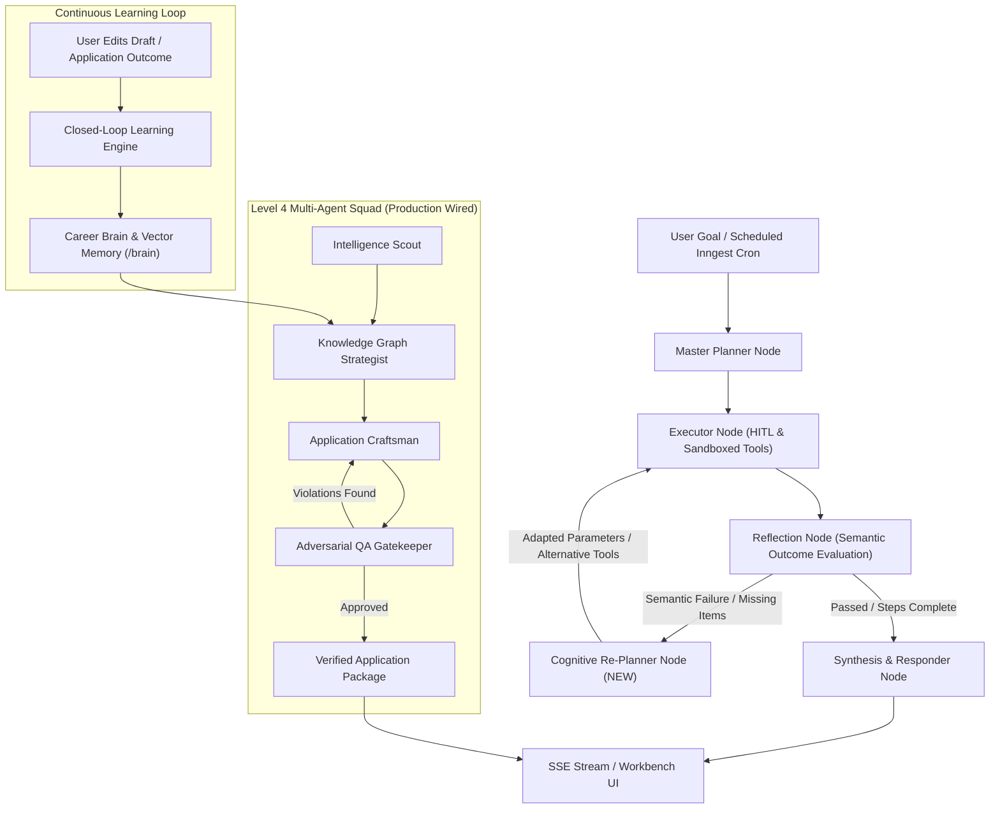

# Truly Autonomous Career Agent Architecture & Execution Plan

> **Goal:** Transform CareerTrack from a Level 3.8 Advanced State Machine into a Level 5 Fully Autonomous Career Operating System with dynamic re-planning, live multi-agent squad collaboration, interactive ground-truth memory curation, and closed-loop user feedback learning.

**Architecture:**
1. **Cognitive Re-Planning**: Close the static retry loop in LangGraph by routing reflection failures to an LLM-driven `replanner` node that dynamically adjusts tool parameters or formulates fallback execution steps.
2. **Production Multi-Agent Squad**: Wire `coordinateApplicationPackageSquad` (Scout $\rightarrow$ Strategist $\rightarrow$ Scribe $\rightarrow$ Critic) into live discovery packaging and resume tailoring endpoints, exposing the deliberation trace in the UI.
3. **First-Class Career Brain (`CAG-13`)**: Elevate `UserMemory` and `CareerKnowledgeGraph` from hidden settings to a dedicated `/brain` workspace where candidates inspect and pin verified ground truth.
4. **Closed-Loop Feedback**: Automatically detect user edits to generated assets and real-world outcomes (interviews/offers/rejections) to update prompt weights and writing style memories.

**Tech Stack:** Next.js 15, TypeScript, `@langchain/langgraph`, PostgreSQL (Prisma + pgvector), Inngest, Tailwind CSS (Stripe design system), Vitest.

---

## Architecture Flowchart



---

## Phased Implementation Plan

### Task 1: Fix Test Regression & Refine Reflection Step Semantics
**Files:**
- Modify: `src/lib/ai/graph/nodes/reflection.ts:8-40`
- Modify: `src/lib/ai/__tests__/langgraph-agent.test.ts:77-89`

**Step 1: Write the failing test expectation**
Ensure that a completed step with valid outcome metadata or standard completion status passes semantic evaluation, while only actual empty/failed states trigger reflection warnings.

**Step 2: Run test to verify current failure**
```powershell
npx vitest run src/lib/ai/__tests__/langgraph-agent.test.ts
```
Expected: FAIL on line 86.

**Step 3: Update `reflection.ts`**
Differentiate between `result === undefined` when `step.status === "completed"` without tools vs actual execution failures.
```ts
if (currentStep.status === "completed" && (!currentStep.toolName || currentStep.result === undefined)) {
  return {
    reflection: { passed: true, feedback: `Step ${currentStep.id} verified.`, retryCount: 0 },
    currentStepIndex: currentStepIndex + 1,
  }
}
```

**Step 4: Verify test passes**
```powershell
npx vitest run src/lib/ai/__tests__/langgraph-agent.test.ts
```
Expected: 5/5 tests PASS.

---

### Task 2: Implement Dynamic Re-Planner Node in LangGraph StateGraph
**Files:**
- Modify: `src/lib/ai/graph/state.ts`
- Create: `src/lib/ai/graph/nodes/replanner.ts`
- Modify: `src/lib/ai/graph/workflow.ts`
- Create: `src/lib/ai/__tests__/replanner-node.test.ts`

**Step 1: Write failing test for Re-Planner**
Verify that given a failed tool execution (e.g. `searchApplications` returned 0 results for "Sr Rust Lead"), the Re-Planner invokes the model and relaxes query parameters to "Rust Engineer" or provides an alternate tool.

**Step 2: Run test to verify failure**
```powershell
npx vitest run src/lib/ai/__tests__/replanner-node.test.ts
```
Expected: FAIL (module not found).

**Step 3: Implement `createReplannerNode(model)`**
1. Read `reflection.feedback` and `currentStep`.
2. Construct a prompt instructing the LLM to inspect the tool error/empty state.
3. Output updated `toolInput` or replace step with an alternate recovery action.
4. Increment `reflection.retryCount`.

**Step 4: Update `workflow.ts`**
Change conditional edge:
```ts
.addConditionalEdges("reflector", (state: AgentStateType) => {
  if (!state.reflection.passed) {
    return "replanner"
  }
  if (state.plan && state.currentStepIndex < state.plan.length) {
    return "executor"
  }
  return "responder"
})
.addEdge("replanner", "executor")
```

**Step 5: Run tests**
```powershell
npx vitest run src/lib/ai/__tests__/replanner-node.test.ts
```
Expected: PASS.

---

### Task 3: Wire Level 4 Multi-Agent Squad Orchestrator into Production Endpoints
**Files:**
- Modify: `src/lib/discovery/cover-letter-agent.ts:140-230`
- Modify: `src/app/api/resumes/tailor/route.ts:120-210`
- Modify: `src/lib/applications/package-engine.ts:80-160`
- Create: `src/__tests__/squad-production-wiring.test.ts`

**Step 1: Write test verifying that `generateApplicationMaterialsAgent` calls `coordinateApplicationPackageSquad`**
Check that the returned materials include `squadDeliberation` metadata containing:
- `strategistPositioning`
- `criticApproved: true`
- `criticRounds: number`

**Step 2: Run test to verify failure**
```powershell
npx vitest run src/__tests__/squad-production-wiring.test.ts
```

**Step 3: Connect `coordinateApplicationPackageSquad`**
In `src/lib/discovery/cover-letter-agent.ts`:
- Replace the standalone LLM call with `coordinateApplicationPackageSquad`.
- Provide `strategistFn` that queries the Career Knowledge Graph.
- Provide `scribeFn` that drafts materials.
- Critic validates via `evaluateDraft` with strict anti-placeholder & length rubrics.
- Persist `squadTrace` into `ApplicationAnalysis.resumeAdvice.squadTrace`.

**Step 4: Verify test passes**
```powershell
npx vitest run src/__tests__/squad-production-wiring.test.ts
```

---

### Task 4: Expose Multi-Agent Squad Deliberation Trace in Frontend Workbench
**Files:**
- Modify: `src/components/applications/WorkbenchAnalysisTab.tsx`
- Modify: `src/components/applications/types.ts`
- Create: `src/components/applications/SquadDeliberationCard.tsx`
- Create: `src/__tests__/squad-trace-ui.test.tsx`

**Step 1: Write component test**
Verify that when `squadTrace` exists on `ApplicationAnalysis`, `SquadDeliberationCard` renders:
- Scout badge with company intelligence highlights.
- Strategist badge with matched Knowledge Graph evidence.
- Critic badge with "Adversarial Check Passed (0 Placeholders, Grounded in Verified Metrics)".
- Strictly 0 Sparkles icons (uses `Layers`, `ShieldCheck`, `Bot`).

**Step 2: Run UI test**
```powershell
npx vitest run src/__tests__/squad-trace-ui.test.tsx
```

**Step 3: Implement `SquadDeliberationCard.tsx`**
Build the linear blueprint card with semantic tokens, collapsible drawer, and badge indicators.

**Step 4: Verify UI test passes**
```powershell
npx vitest run src/__tests__/squad-trace-ui.test.tsx
```

---

### Task 5: Deploy First-Class "Career Brain" Ground Truth Dossier UI (`CAG-13`)
**Files:**
- Create: `src/app/(app)/brain/page.tsx`
- Create: `src/components/brain/CareerBrainDossier.tsx`
- Create: `src/components/brain/KnowledgeGraphViewer.tsx`
- Create: `src/components/brain/LearnedWeaknessesCard.tsx`
- Create: `src/app/api/user/brain/route.ts`
- Create: `src/__tests__/career-brain.test.tsx`

**Step 1: Write API & UI test**
Verify that `GET /api/user/brain` returns:
- Knowledge Graph nodes & edges
- Pinned non-negotiable career constraints
- Learned interview weaknesses with mastery status
- Verified project metrics

**Step 2: Implement Backend API `GET & PATCH /api/user/brain`**
Supports tenant isolation, updating node weights, pinning memory constraints, and toggling weakness resolved status.

**Step 3: Implement Frontend Page `/brain`**
- Uses `@/components/primitives/PageContainer` and `PageHeader`.
- Linear 4-stat metric strip (`Verified Skills`, `Proof Projects`, `Learned Gaps`, `Mastered Gaps`).
- Tabs: "Knowledge Graph", "Interview Weaknesses", "Career Constraints".

**Step 4: Verify test suite**
```powershell
npx vitest run src/__tests__/career-brain.test.tsx
```

---

### Task 6: Autonomous Closed-Loop Feedback Engine (Bidirectional Learning)
**Files:**
- Modify: `src/lib/ai/learning-engine.ts`
- Modify: `src/app/api/applications/[id]/analysis/route.ts`
- Create: `src/__tests__/closed-loop-learning.test.ts`

**Step 1: Write failing test**
When a candidate edits a generated cover letter or outreach draft via `PATCH /api/applications/[id]/analysis`, calculate word-level diff. If significant stylistic edits are found, extract preference signal (e.g. "Prefers concise 3-paragraph format without rhetorical questions") and store into `UserMemory` with `category: "preference"`.

**Step 2: Implement Diff & Preference Learning in `learning-engine.ts`**
- Add `analyzeUserEditDifference(originalDraft, editedDraft)`.
- If edit distance $> 20\%$, trigger lightweight LLM summarization of user writing style.
- Upsert into `UserMemory(category: "preference", source: "user_edit")`.

**Step 3: Run tests**
```powershell
npx vitest run src/__tests__/closed-loop-learning.test.ts
```

---

## Full Verification & Quality Gates

```powershell
# 1. Typecheck & Build
npm run build --no-lint

# 2. Complete Vitest Suite (All 83+ test files)
npx vitest run

# 3. Icon Audit (Strictly 0 Sparkles)
Get-ChildItem -Path src -Recurse -Include *.tsx,*.ts | Select-String "Sparkles"
```
