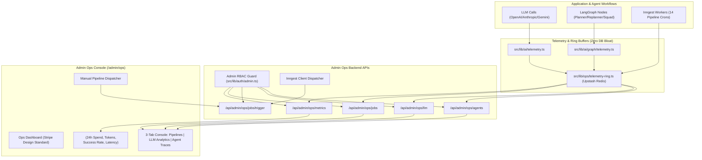

# Admin Ops & Observability Platform Implementation Plan

> **For Claude:** REQUIRED SUB-SKILL: Use superpowers:executing-plans to implement this plan task-by-task.

**Goal:** Build a production-grade, high-performance Admin Ops & Observability dashboard (`/admin/ops`) for CareerTrack to monitor all Inngest background jobs, LLM token usage/costs, and LangGraph agent execution traces in real time with sub-30ms response times and zero database bloat.

**Architecture:** Combine Upstash Redis ring buffers and sliding-window aggregators with the existing Langfuse telemetry (`src/lib/ai/telemetry.ts`) and Inngest event dispatcher (`src/inngest/client.ts`). Implement a robust RBAC admin security gate, dedicated Ops REST APIs, and a sleek Stripe-standard UI built entirely from `@/components/primitives`.

**Tech Stack:** Next.js 15 App Router, TypeScript, Upstash Redis, Inngest SDK v3, Langfuse, Lucide Icons (strictly no Sparkles), Tailwind CSS, Vitest.

---

## Architecture Flowchart

---

## Phased Tasks

### Task 1: Admin RBAC Security Guard
**Files:**
- Create: `src/lib/auth/admin.ts`
- Test: `src/__tests__/admin-auth.test.ts`

**Step 1: Write the failing unit test**
Test that `assertAdminUser` and `isUserAdmin` properly identify authorized admins (via Clerk metadata, `ADMIN_USER_IDS` env list, or dev bypass) and reject non-admin users with 403 Forbidden.

**Step 2: Run test to verify it fails**
`npx vitest run src/__tests__/admin-auth.test.ts`

**Step 3: Implement minimal admin guard**
Create `src/lib/auth/admin.ts` with Clerk auth extraction and zero-trust verification.

**Step 4: Run test to verify it passes**
`npx vitest run src/__tests__/admin-auth.test.ts`

**Step 5: Commit**
`feat(admin): implement rbac admin authorization guard`

---

### Task 2: High-Performance Redis Ops Ring Buffer & Telemetry Bridge
**Files:**
- Create: `src/lib/ops/telemetry-ring.ts`
- Modify: `src/lib/ai/telemetry.ts`
- Modify: `src/lib/ai/graph/telemetry.ts`
- Test: `src/__tests__/admin-ops-telemetry.test.ts`

**Step 1: Write the failing unit test**
Test recording of LLM calls, agent node steps, and job runs into Redis ring buffers (`ops:llm:recent`, `ops:stats:daily`, `ops:agent:recent`), verifying sliding window limits, token rollup calculations, and estimated cost computation.

**Step 2: Run test to verify it fails**
`npx vitest run src/__tests__/admin-ops-telemetry.test.ts`

**Step 3: Implement `src/lib/ops/telemetry-ring.ts` and wire into `src/lib/ai/telemetry.ts`**
Add non-blocking `recordLLMCallToRing` and `recordAgentStepToRing`.

**Step 4: Run test to verify it passes**
`npx vitest run src/__tests__/admin-ops-telemetry.test.ts`

**Step 5: Commit**
`feat(ops): add redis ring buffer telemetry and cost aggregation engine`

---

### Task 3: Inngest Function Catalog & On-Demand Dispatcher
**Files:**
- Create: `src/lib/ops/inngest-catalog.ts`
- Test: `src/__tests__/inngest-catalog.test.ts`

**Step 1: Write the failing unit test**
Test catalog definition of all 14 registered Inngest pipelines (`batch-job-pipeline`, `daily-job-hunt`, `agent-proactive-daemon`, etc.) and event triggering validation.

**Step 2: Run test to verify it fails**
`npx vitest run src/__tests__/inngest-catalog.test.ts`

**Step 3: Implement `src/lib/ops/inngest-catalog.ts`**
Catalog metadata, cron definitions, descriptions, categories, and `triggerInngestPipeline` helper.

**Step 4: Run test to verify it passes**
`npx vitest run src/__tests__/inngest-catalog.test.ts`

**Step 5: Commit**
`feat(ops): build inngest function catalog and trigger dispatcher`

---

### Task 4: Admin Ops API Endpoints
**Files:**
- Create: `src/app/api/admin/ops/metrics/route.ts`
- Create: `src/app/api/admin/ops/jobs/route.ts`
- Create: `src/app/api/admin/ops/jobs/trigger/route.ts`
- Create: `src/app/api/admin/ops/llm/route.ts`
- Create: `src/app/api/admin/ops/agents/route.ts`
- Test: `src/__tests__/admin-ops-api.test.ts`

**Step 1: Write the failing test**
Validate GET endpoints require admin authorization and return structured JSON, and POST trigger validates job ID.

**Step 2: Run test to verify it fails**
`npx vitest run src/__tests__/admin-ops-api.test.ts`

**Step 3: Implement the 5 API routes**
Connect routes to `telemetry-ring.ts`, `inngest-catalog.ts`, and `admin.ts`.

**Step 4: Run test to verify it passes**
`npx vitest run src/__tests__/admin-ops-api.test.ts`

**Step 5: Commit**
`feat(api): implement admin ops rest endpoints for metrics, jobs, and traces`

---

### Task 5: Stripe-Standard Admin Ops Dashboard UI
**Files:**
- Create: `src/app/(app)/admin/ops/page.tsx`
- Create: `src/components/ops/InngestJobMonitor.tsx`
- Create: `src/components/ops/LLMUsageMonitor.tsx`
- Create: `src/components/ops/AgentTraceMonitor.tsx`
- Modify: `src/components/layout/Sidebar.tsx` (add Admin Ops link visible to admins)

**Step 1: Build the UI components following `AGENTS.md`**
- Use `<PageContainer>`, `<PageHeader>`, `<KPIStrip>`, `<BlueprintCard>`, `<StatusBadge>`.
- Strictly no gradients, solid backgrounds, 1px hairline borders, tabular-nums for metrics.
- Strictly no Sparkles icon (use `Activity`, `Cpu`, `Zap`, `Terminal`, `Layers`, `ShieldCheck`).
- Fast tab switching between Jobs, LLM calls, and Agent traces.
- 1-click "Trigger Now" button with loading state and toast feedback.

**Step 2: Typecheck and Build verification**
`npx tsc --noEmit`

**Step 3: Commit**
`feat(ui): create stripe-standard admin ops and observability dashboard`
